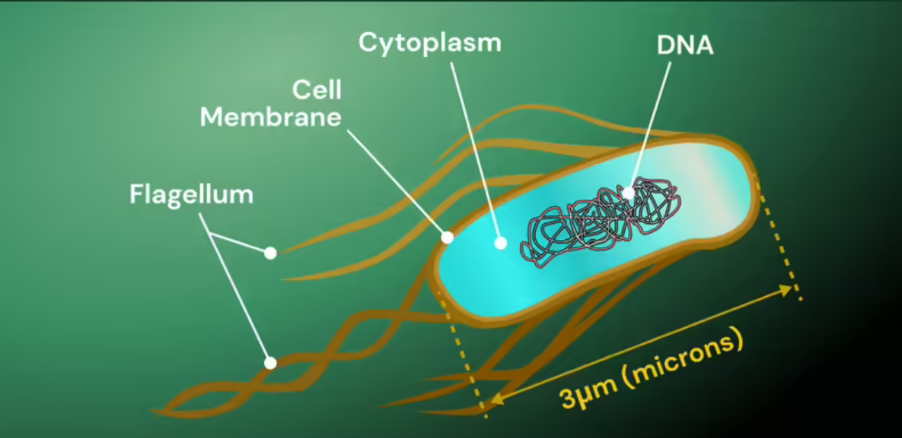

# Goal: Fine Tunning of DNABERT
This repo contains a simple program that tries annotate the gene sequence of a Bacteria, called E_coli_K12. We will try to use a pretrained DNABERT transfomrer-encoder to do a binarty classification: Coding section of DNA-molecule-sequnce (also called gene) labeled 1, and the non-coding part of DNA-molecule-sequence is labeled as 0. Below is a picture of E-coli nad its DNA part. Pay attention to: (I) The DNA molecule, and (II) The cell and cell shell which contains DNA molecule



## 1 Preprocessing
preprocessing.py provides some code to read the genome files and make the test and train datasets  based on that. There are some unit test in this file that should be self-explainatory. The goal is in the main.py, we make the following calls to get the required datasets.

**Run preprocessing.py**: Before going to main.py, it is better to run the preprocessing.py for a fake genome with much shorter genome length.

**main.py**:

```python
ecoli_genome, gt_gen_seq_coor, _, _ = preprocessing._get_data(genome_seq_dir="./E_coli_K12_MG1655_U00096.3.txt", gt_dir="./Gene_sequence.txt")
preProcessObj3 = preprocessing.PreProcessData(genome=ecoli_genome, gt_gen_seq_coor=gt_gen_seq_coor,
                            train_fraction=0.7, windows=[75], k_mer_val=6,
                                genome_name="ecoli")
preProcessObj3.make_datasets()
```


## 2 Reading the dataset
We have 2 raw files to read and then build our test/train dataset . The [genome](./E_coli_K12_MG1655_U00096.3.txt) which contains the whole DNA-molecula-sequence including the coding and non-coding section (As we know the coding section is called gene), and the other file is the gene-annotation file: [gene-sequnce](./Gene_sequence.txt) which only shows details of each coding section of the total DNA-molecule-sequnce. We have 4,726 gene (coding sections) in E-coli DNA molecule.

Below shows 3 rows, corresponding to 3 genes (coding section) annotated in [gene-sequnce](./Gene_sequence.txt). What matters the most is the starting and ending indedices to extract this partcular gene from the original [genome](./E_coli_K12_MG1655_U00096.3.txt) file:
```python
ECK120001251	thrL(b0001)	190	 255	     forward	-	<i>thr</i> operon leader peptide	                ATG	TGA	ATGAAAC........GGGCTGA	b0001		
ECK120000987	thrA(b0002)	337	 2799	     forward	-	fused aspartate kinase/homoserine dehydrogenase 1	ATG	TGA	ATGCGAGTGTTGAAG......TGGAAGTTAGGAGTCTGA	b0002		
ECK120000988	thrB(b0003)	2801 3733	     forward	-	homoserine kinase	                                ATG	TAA	ATGGTTAAAGTTTAT.......CTGGAAAACTAA	b0003		
```

**The difference b/w forward/backward gene**: In the context of the E. coli genome, "forward" and "backward" genes refer to the strand orientation of the genes on the DNA molecule. DNA is double-stranded, with each strand running in opposite directions: one strand runs in the 5' to 3' direction, and the complementary strand runs in the 3' to 5' direction. Below are two example of annotation of a genome file.

A forward gene, means the gene starts at position 500, ends at position 1500, and is transcribed from the forward strand.
```python
geneName: start=500, end=1500, strand=forward
```

A backward gene, means the gene starts at position 1600, ends at position 2100, and is transcribed from the backward (or reverse) strand.
```python
gene: start=1600, end=2100, strand=backward
```

## Code Notes
["Code Notes"](./notes) are in Persian :).


## Downloading the pretrained DNABERT model
The following code snippet in main.py tries to download a pretrained DNABERT and unzipp it. The unzipped files will be placed in a specific folder.
If downloading from google-drive is problemaic, the code in colab file could be helpful.

```
current_path = "./" if not debug_flag else file_dir + "/"
if fine_tune_DANABERT_using_pretrained_model:
    if not os.path.exists(current_path + "pretrained_DNA/"):
        os.makedirs(current_path + "pretrained_DNA/")
        print("A new directory is created to hold the pretrained DNAERT model.")

    # as of now the gdown only downloads in Colab, not in an script
    if not os.path.isfile(current_path + "6-new-12w-0.zip"):
        url = "https://drive.google.com/u/0/uc?id=1BJjqb5Dl2lNMg2warsFQ0-Xvn1xxfFXC&export=download&confirm=t&uuid=574dd7fc-207b-43c4-b502-ab6a52549838&at=ALgDtswq3dLLBv3bezvOuM8dlJG-:1679328206346"
        gdown.download(url, quiet=False)

    with zipfile.ZipFile(current_path + "6-new-12w-0.zip", "r") as zip_ref:
        zip_ref.extractall(current_path + "pretrained_DNA/")
```

## Cloning DNABERT
cloning the DNABERT first:

```
git clone https://github.com/jerryji1993/DNABERT.git
```
Then make he necessary changes in versions, by calling "minor_version_changes_in_DNABERT()" method in helpere.py.
Afterward, we can install an edditable version of DNABERT in our local env.

after installing DNABERT locally, we should install the following packages in our local env.
```
tensorboardX
tensorboard
scikit-learn >= 0.22.2
seqeval
pyahocorasick
scipy
statsmodels
biopython
pandas
pybedtools
sentencepiece==0.1.99
```

